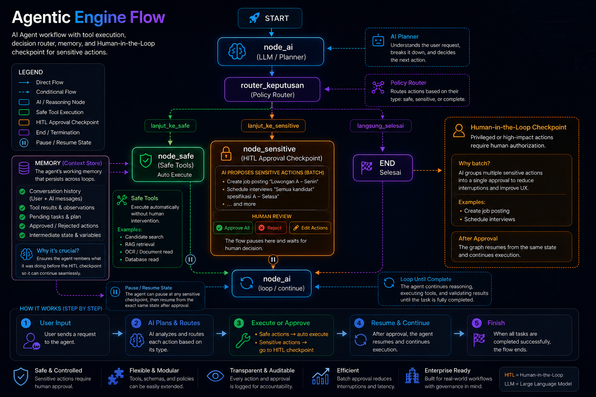

# 🤖 RekrutYuk

AI Based recruitment Platform untuk otomatisasi recruitment, parsing CV, dan *screening* otomatis yang berjalan **100% lokal** di PC Anda! Tidak ada kebocoran data pelamar, tidak ada biaya API dolar bulanan. Cukup pasang, dan biarkan sistem Agen AI mengelola alur Recruitment Anda secara mandiri 💼✨

---

### 🧠 The Tech Stack Inside
*   **The Brain:** [Ollama](https://ollama.com/) + **Qwen3.5:4B** (Model Kecil tapi handal, dan sangat pas untuk VRAM lokal)
*   **The Orchestrator:** **LangGraph** & **LangChain** (Arsitektur Agentic AI sejati dengan State Machine dinamis)
*   **The Knowledge:** **ChromaDB** (Vektor database untuk Unstructured RAG) & **SQLite** (Structured RAG & memori permanen)
*   **The Interface Control:** **Telegram Bot API & Local Watchdog** (Data Ingestion stage.)
*   **The Runtime:** **Python 3.11** 🐍

---

### 🌟 Arsitektur Utama: Agentic AI + RAG Dual-Core

Aplikasi **RekrutYuk** ini bukan sekadar aplikasi CRUD biasa atau chatbot pasif, melainkan perpaduan dua teknologi AI terdepan saat ini:

*   **Agentic AI Engine (Autonomous Reasoning):** Menggunakan graf dinamis LangGraph untuk memberikan AI "otak" dalam menentukan langkah selanjutnya. Agen bisa merencanakan strategi sendiri: kapan harus melihat daftar kandidat, kapan harus mendalami CV secara kualitatif, hingga mendeteksi *tool calling* secara otomatis.
*   **Hybrid RAG Architecture (Local Knowledge Base):** 
    *   *Unstructured RAG:* Memotong dan mengindeks berkas dokumen CV (PDF) mentah ke ChromaDB untuk pencarian semantik mendalam.
    *   *Structured RAG:* Mengekstrak data berantakan dari AI menjadi skema JSON rapi di SQLite untuk kebutuhan statistik analitik HR yang presisi.

---

### 🎯 What Makes It Awesome?

*   **Human-in-the-Loop (HITL) Guardrail:** Aksi sensitif (seperti posting lowongan atau hapus data) dikunci oleh interupsi graf. AI tidak akan mengeksekusi ke database sebelum mengirimkan notifikasi konfirmasi ke Telegram Anda. Tekan **"IYA"**, baru Agen AI bergerak!
*   **Anti-Amnesia Persistent Memory:** Ditenagai oleh `SqliteSaver`, yang membuat agen AI ini punya memori jangka panjang. Biarpun aplikasi di-restart atau komputer mati, Agen tetap ingat siapa kandidat terakhir yang sedang dibahas dan apa tugas terpendingnya.

---
